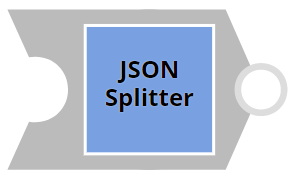
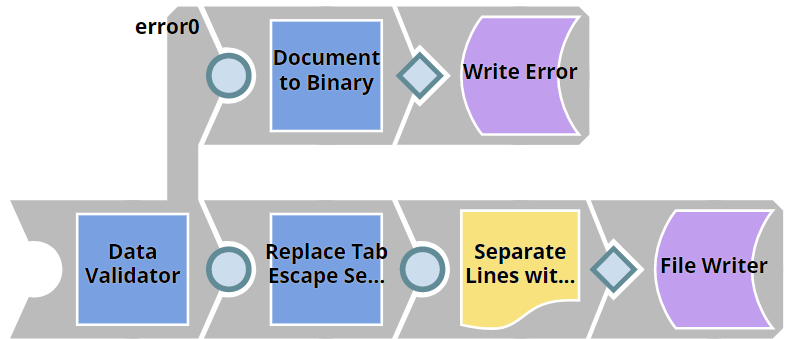
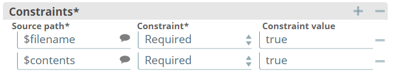
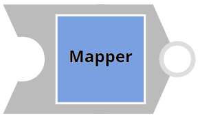
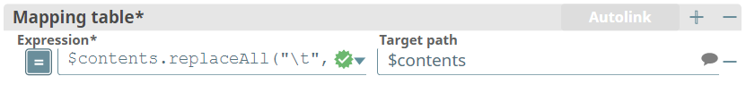

# SnapLogic Expression Libraries

Process for updating expression files and libraries in SnapLogic.

___

Table of Contents
- [SnapLogic Expression Libraries](#snaplogic-expression-libraries)
  - [About](#about)
  - [Behavior](#behavior)
    - [Intended Behavior](#intended-behavior)
    - [Current Behavior](#current-behavior)
  - [Functionality](#functionality)
    - [Roadmap](#roadmap)
    - [Client Sends Request](#client-sends-request)
    - [Mapping](#mapping)
      - [Object Format](#object-format)
      - [Map Format](#map-format)
      - [Accessing Map Contents](#accessing-map-contents)
        - [Root Keys](#root-keys)
        - [Nested Keys](#nested-keys)
  - [SnapLogic Pipeline](#snaplogic-pipeline)
    - [Triggered Task](#triggered-task)
    - [Parent Pipeline](#parent-pipeline)
      - [Data Validator](#data-validator)
      - [JSON Splitter](#json-splitter)
      - [Pipeline Execute](#pipeline-execute)
    - [Child Pipeline](#child-pipeline)
      - [Data Validator with Error Output](#data-validator-with-error-output)
      - [Mapper](#mapper)
      - [Fixed Width Formatter](#fixed-width-formatter)
      - [File Writer](#file-writer)
      - [Error View](#error-view)
        - [Document to Binary](#document-to-binary)
        - [File Writer](#file-writer-1)
___


## About

---

SnapLogic uses .expr files to store variables on generic pipelines. Currently, these files are stored and modified in SnapLogic and there is no visible change history. The primary purpose of this project is to maintain file change history and be able to update expression files in SnapLogic via pull requests in GitHub. Ideally, the project will also validate that the files follow certain linting rules to provide consistency in spaces and comments.

## Behavior

### Intended Behavior

New, modified, or deleted files merged into the master or base branch in a GitHub repository will be systematically added, modified, or deleted from SnapLogic Manager to mirror the GitHub repository. 

### Current Behavior

Currently, new and modified files merged into the master or base branch in a GitHub repository will be systematically added or modified from SnapLogic Manager, mirroring the GitHub repository. Deleted files merged into the master or base branch in a GitHub repository will **not** be systematically deleted from SnapLogic Manager.

## Functionality

### Roadmap

  1. Client creates a pull request to master branch on GitHub
  2. If pull request is merged, Jenkins is triggered via GitHub webhook
  3. Jenkins retrieves all changed files from the pull request and each file is made into an object
  4. Jenkins constructs a [map of the changed file objects](#mapping)
  5. Jenkins posts map to SnapLogic
  6. SnapLogic task is triggered and files are written via pipeline

### Client Sends Request

* A POST request can be sent to the SnapLogic API using [Postman](https://www.postman.com/)

### Mapping

#### Object Format

For every file that has been uploaded or changed, an object is created with this format:

```groovy
{"1":{"filename":"file1","contents":"contents1"}}
```
#### Map Format

All objects are then grouped in a map with this format:

```groovy
{"1":{"filename":"file1","contents":"contents1"},
"2":{"filename":"file2","contents":"contents2"},
"3":{"filename":"file3","contents":"contents3"},
"4":{"filename":"file4","contents":"contents4"}
}
```

This map that contains all of the individual changed files as objects is a groovy object that is later serialized into JSON strings using JsonOutput.toJson(). The json strings are then posted to the SnapLogic server through the [HTTP POST Method](https://developer.mozilla.org/en-US/docs/Web/HTTP/Methods/POST)

#### Accessing Map Contents

##### Root Keys

Each file has a unique numbered key so that overwrites are not a problem. The numeric keys are root keys and can be considered parents to the nested keys “filename” and “contents”.  Root key values can be accessed through this format:

```java
println("Key 1: ${map[1]}")
println("Key 2: ${map[2]}")
println("Key 3: ${map[3]}")
println("Key 4: ${map[4]}")
```
##### Nested Keys

However, these keys are arbitrary and will likely not need to be accessed. The values of the nested keys “filename” and “contents” will need to be accessed and can be accessed through this format:

```java
${obj["1"].filename}
${obj["1"].contents}
```

## SnapLogic Pipeline

* Parent Pipeline URL: [SL-exprlib-p](https://google.com)
* 
* Child Pipeline URL: [SL-exprlib-c](https://google.com)

### Triggered Task
* Cloud URL: https://elastic.snaplogic.com:443/api/1/rest/slsched/feed/MAYASORG/projects/expression_library_integration/SL-exprlib-task

### Parent Pipeline


#### Data Validator


The first snap in the parent pipeline is a [Data Validator Snap](https://docs-snaplogic.atlassian.net/wiki/spaces/SD/pages/1438457/Data+Validator). This snap provides functionality to validate the incoming data from Jenkins against the set of defined constraints. Here, the defined constraints are **filename** and **contents**. These constraints are required for the data to be validated.

#### JSON Splitter



The second snap in the parent pipeline is a [JSON Splitter Snap](https://docs-snaplogic.atlassian.net/wiki/spaces/SD/pages/1438285/JSON+Splitter). This snap splits the objects that are contained within the map posted by Jenkins into separate documents. The Json Path is 
> jsonPath($, "[*]")
and this defines the path to the list that holds the document entries. 

#### Pipeline Execute


The final snap in the parent pipeline is a [Pipeline Execute Snap](https://docs-snaplogic.atlassian.net/wiki/spaces/SD/pages/1438684/Pipeline+Execute). This snap triggers the execution of the child pipeline for each document that was output by the JSON Splitter. There are pipeline parameters that are included in this snap. These parameters are 
```filename```
and
```contents```

and they have the respective values of ```$filename```
and ```$contents```

These pipeline parameters are parameters for the child pipeline that is to be executed. 

### Child Pipeline



#### Data Validator with Error Output

The first snap in the child pipeline is a [Data Validator Snap](https://docs-snaplogic.atlassian.net/wiki/spaces/SD/pages/1438457/Data+Validator). This snap provides functionality to validate the incoming data from Jenkins against the set of defined constraints. Here, the defined constraints are **filename** and **contents**. These constraints are required for the data to be validated.



If the data passed from the parent pipeline is **not** validated, errors are routed to [Error View](#errors) and written to an error log. 

#### Mapper



The second snap in the child pipeline is a [Mapper Snap](https://docs-snaplogic.atlassian.net/wiki/spaces/SD/pages/1438286/Mapper). This snap transforms incoming data using the given mappings and produces new output data. Here, all instances of the java escape sequence "\t" in the mapping are replaced with four spaces which equates to a tab.



#### Fixed Width Formatter


The third snap in the child pipeline is a [Fixed Width Formatter Snap](https://docs-snaplogic.atlassian.net/wiki/spaces/SD/pages/1439009/Fixed+Width+Formatter). This snap separates lines that have the new line character "\n". 

#### File Writer


The final snap in the child pipeline is a [File Writer Snap](https://docs-snaplogic.atlassian.net/wiki/spaces/SD/pages/1438927/File+Writer). This snap writes the formatted binary data that has been passed to it through the pipeline to a file. The name of the file is the name that is carried in the "filename" variable. If a file with this name already exists, it is overwritten with the new contents. 

#### Error View

When data fails validation against the defined constraints, it is routed to Error View.

##### Document to Binary


Unvalidated data is then passed through a [Document To Binary Snap](https://docs-snaplogic.atlassian.net/wiki/spaces/SD/pages/1438976/Document+to+Binary). This snap converts the 'content' value in the input document map to a binary data at the output view. Other entries in the input map are passed to the header document in the output binary data.

##### File Writer


The final snap in the error view of the child pipeline is a [File Writer Snap](https://docs-snaplogic.atlassian.net/wiki/spaces/SD/pages/1438927/File+Writer). This snap writes the binary data to a file named **exprlib-c_error.log**. Everytime there is an error, the file is appended. 

